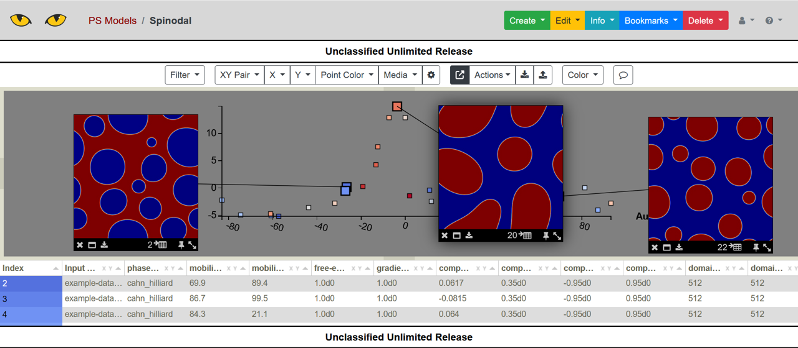

.. 
   Copyright (c) 2024 National Technology and Engineering Solutions of Sandia, LLC.  
   Under the terms of Contract DE-NA0003525 with National Technology and Engineering 
   Solutions of Sandia, LLC, the U.S. Government retains certain rights in this software.

Algorithms
==========

The ensemble toolkit includes various algorithms for dimension reduction that can be
imported directly into parameter space.  Other algorithms could in the future be
incorporated in a similar fashion.

Dimension Reduction
-------------------

A variety of dimension reduction techniques can be applied to simulation output
using the reduce.py script, inlcuding PCA, Isomap, tSNE, and deep learning auto-encoders.
In this section we show an example using only the final time step of the phase-field simulation
data with PCA, Isomap, and tSNE.  We will import our results into a parameter space model.

First, we generate images of the final time step from the dataset.

.. code-block:: bash

    python -m slypi.ensemble.convert --ensemble example-data/spinodal/workdir.%d --input-files out.cahn_hilliard_50000000.npz --output-dir example-data/spinodal-out --output-format jpg --over-write --csv-out end-state.csv --csv-header "End State" --plugin convert --suffix phase_field

This command creates .jpg files in the spinodal-out directory that we can later reference in
the parameter space model using file pointers.  Next, we compute PCA with auto-correlation 
using the ``reduce.py`` script.

.. code-block:: bash

    python -m slypi.ensemble.reduce --ensemble example-data/spinodal/workdir.%d --input-files out.cahn_hilliard_50000000.npz --output-dir example-data/spinodal-out --output-file out.cahn_hilliard_PCA.rd.npy --algorithm PCA --num-dim 2 --over-write --auto-correlate --binary --xy-out auto-PCA-end-state.csv --xy-header "Auto-PCA End State" --xy-ps-tag

We can also compute Isomap as follows.  The option --xy-ps-tag inserts tags recognized
by parameter space that allow the user to select an (x,y) pair of coordinates to display
in the scatter plot.

.. code-block:: bash

    python -m slypi.ensemble.reduce --ensemble example-data/spinodal/workdir.%d --input-files out.cahn_hilliard_50000000.npz --output-dir example-data/spinodal-out --output-file out.cahn_hilliard_Isomap.rd.npy --algorithm Isomap --num-dim 2 --over-write --auto-correlate --binary --xy-out auto-Isomap-end-state.csv --xy-header "Auto-Isomap End State" --xy-ps-tag

Then we can combine the results of PCA and Isomap into a single table.  

.. code-block:: bash

    python -m slypi.ensemble.table --join example-data/spinodal/metadata.csv example-data/spinodal-out/movies.csv example-data/spinodal-out/end-state.csv example-data/spinodal-out/auto-PCA-end-state.csv example-data/spinodal-out/auto-Isomap-end-state.csv --output-dir example-data/spinodal-out --ignore-index --csv-out ps-PCA-Isomap.csv --csv-no-index --over-write

Finally, this table can be uploaded to Slycat as a parameter space model.

.. code-block:: bash

    python -m slypi.ps.upload_csv example-data/spinodal-out/ps-PCA-Isomap.csv --marking uur --project-name "PS Models" 

reduce.py
^^^^^^^^^

Here are the full set of options for ``reduce.py``.  In the above example, we are using
the default parameter space plugin.

.. code-block:: bash

    python -m slypi.ensemble.reduce --help

.. program-output:: python -m slypi.ensemble.reduce --help

The reduction algorithms themselves are specified using the ``reduction.py`` options.

.. code-block:: bash

    python -m slypi.ensemble.algorithms.reduction --help

.. program-output:: python -m slypi.ensemble.algorithms.reduction --help
