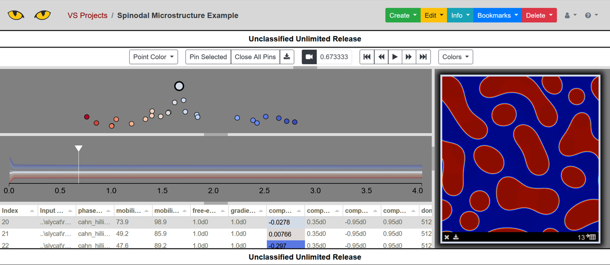

.. 
   Copyright (c) 2024 National Technology and Engineering Solutions of Sandia, LLC.  
   Under the terms of Contract DE-NA0003525 with National Technology and Engineering 
   Solutions of Sandia, LLC, the U.S. Government retains certain rights in this software.

Tutorial
========

Here we provide a quick tutorial for using SlyPI.  We focus on using SlyPI to 
upload models from the command line.  More advanced scenarios, such as using 
SlyPI from within other Python scripts, will be discussed later.

Command Line
------------

Every SlyPI script can be accessed from the command line using the Python module
syntax.  Every script has a help function.  For example, the following shows 
the help for the ``list_markings.py`` script.

.. code-block:: bash

  python -m slypi.util.list_markings --help

.. program-output:: python -m slypi.util.list_markings --help

Connection to Server
--------------------

The easiest way to check if your connection to the Slycat server is working is in fact 
to use the ``list_markings.py`` script.

.. code-block:: bash

  python -m slypi.util.list_markings --host https://your-host --kerberos

You will of course need to use the appropriate authentication for your server.

Data
----

The data used in these examples can be found in the example-data directory in the SlyPI
repository.  The data sets consist of the following:

* cars.csv -- A dataset describing cars from 1970, 1976, and 1982.  This was converted to .csv from the carsmall.mat dataset in Matlab.
* weather-dac-gen-pca.zip -- A dataset containing weather measurements over the year 2014 for the 100 largest cities in the United States.
* spinodal -- A small subset from a larger study using numerical simulation data to model microstructure evolution.

The spinodal dataset is described in greater detail in the papers [Desai2024], [Hu2022], and [Stewart2020].

Parameter Space
---------------

The Slycat Parameter Space model is the simplest way to use Slycat for visualization.
A Parameter Space model performs no analysis and requires only a table in .csv format.
Each row of the table describes a single data point (typically representing a single 
numerical simulation) and can include numerical data, strings, and even file pointers 
which can be display by Slycat to view images, videos, pdfs, and 3D mesh data that may 
be associated with a provided row.

To upload a parameter space model using the cars data to a Slycat server, use

.. code-block:: bash

  python -m slypi.ps.upload_csv example-data/cars.csv --marking uur  --project-name "PS Models"

A particular feature of interest to anyone wanting to use Parameter Space to visualize the 
results of their own algorithm is the use of a (x,y) pair tag in the .csv header.  (The tags 
are ``[XY Pair X]`` for the x-coordinate and ``[XY Pair Y]`` for the y-coordinate.)  These tags
will be recognized in Parameter Space and allow the user to select a coordinate pair for 
the scatter plot display instead of having to select two single variables separately.  This 
feature will be demonstrated in a later example showing how to incorporate new algorithms 
into Slycat.

Canonical Correlation Analysis (CCA)
------------------------------------

The Slycat CCA model performs a statistical analysis known as Canonical Correlation Analysis.
CCA operates on a dataset with two type of variables, input variables and output variables, as
are typically present in numerical simulation data.  CCA finds the largest correlations between
combinations of inputs variables (a "canonical" input) and combinations of output variables 
(a "canonical" output).  These correlations can then be visualized in Slycat to understand which
inputs most affect which outputs.

To upload a CCA model to Slycat using the cars data, use:

.. code-block:: bash

  python -m slypi.cca.upload_csv example-data/cars.csv --input-columns Cylinders Displacement Weight Year Origin --output-columns MPG Horsepower Acceleration --project-name "CCA Models"

.. Time-Series
   -----------

Dial-A-Cluster
--------------

Dial-A-Cluster (DAC) is a Slycat model used for interactive visualization of multivariate 
time series data.  DAC allows the user to select which time series and how much those time 
series influence a dimension reduction using Multidimensional Scaling (MDS).  By adjusting 
the influence of the available time series, the user can investigate clusters and correlation 
in their time series data.  More details describing this approach and the underlying algorithms 
can be found in the paper [Martin2016].

To upload a DAC model into Slycat, use:

.. code-block:: bash

  python -m slypi.dac.upload_gen example-data/weather-dac-gen-pca.zip  --project-name "DAC Models"

A special format is required for uploading a DAC model.  An example of this format is 
provided in the weather-dac-gen-pca.zip file.  A more detailed description of this format 
can be found in the Slycat User Manual at 
https://slycat.readthedocs.io/en/latest/manual/DAC_Manual/DACGenericFormat.html.

VideoSwarm
----------

VideoSwarm models in Slycat use a time-aligned dimension reduction algorithm to visualize ensembles
of videos created from numerical simulation data.  Creating a VideoSwarm model involves multiple steps
that are described below.  For our example, we use the spinodal example dataset, which is structured
as follows:

.. code-block:: bash

    spinodal
    |-- metadata.csv
    |-- workdir.460
        |-- out.cahn_hilliard_0.jpg
        |-- out.cahn_hilliard_500000.jpg
        |-- ...
    |-- workdir.467
    |-- workdir.473
    ...

These files are a subset of the files that would typically be produced by running an ensemble of
numerical simulations, and are organized as would be typical for that situation.  The metadata.csv
file contains a table with the inputs of each simulation run, and the folders ``workdir.*`` contain
image outputs of the simulation at selected timesteps in the files ``out.cahn_hilliard_*.jpg``.

The first step in creating a VideoSwarm model is compiling the images produced by the simulation into
videos.  This can be done using:

.. code-block:: bash

  python -m slypi.ensemble.convert --ensemble example-data/spinodal/workdir.%d --input-files out.cahn_hilliard_%d.npz --output-dir example-data/spinodal-out --csv-out movies.csv --csv-header Movie --output-format mp4 --plugin convert --suffix phase_field --over-write

The output of this command will consist of the generated movies in a new directory 
``example-data/spinodal-out`` mirroring the file structure of the input data,
with a table containing pointers to each of the movies in the file ``movies.csv``.

The next step is to generate the VideoSwarm files to upload to Slycat by running the
time-aligned dimension reduction algorithm.  This is done using:

.. code-block:: bash

  python -m slypi.ensemble.reduce --ensemble example-data/spinodal/workdir.%d --input-files out.cahn_hilliard_%d.npz --output-dir example-data/spinodal-out --algorithm PCA --time-align 10 --num-dim 2 --csv-out time-aligned-pca.csv --csv-header "Time Aligned PCA" --output-file out.cahn_hilliard_time_aligned_PCA.rd.npy --plugin vs --auto-correlate --binary --over-write

Details on the time-aligned algorithm can be found in the paper [Martin2019].  
Finally, we can create the VideoSwarm model files using:

.. code-block:: bash

  python -m slypi.ensemble.table --join example-data/spinodal/metadata.csv example-data/spinodal-out/movies.csv example-data/spinodal-out/time-aligned-pca.csv --output-dir example-data/spinodal-out --ignore-index --csv-out metadata-time-aligned-pca.csv --csv-no-index --over-write

.. code-block:: bash

  python -m slypi.ensemble.table --expand example-data/spinodal-out/metadata-time-aligned-pca.csv --expand-header "Time Aligned PCA" --output-dir example-data/spinodal-out/vs-local --csv-out movies.csv --plugin vs --remove-expand-col --video-fps 25

These commands produces VideoSwarm formatted local files in the directory ``vs-files``.  There are four
files produced, ``movies.csv``, ``movies.xcoords``, ``movies.ycoords``, and ``movies.trajectories``.
These files can be uploaded using the VideoSwarm wizard, or using the upload script:

.. code-block:: bash

  python -m slypi.vs.upload_local --csv-file example-data/spinodal-out/vs-local/movies.csv --xcoords-file example-data/spinodal-out/vs-local/movies.xcoords --ycoords-file example-data/spinodal-out/vs-local/movies.ycoords --traj-file example-data/spinodal-out/vs-local/movies.trajectories --video-column Movie --project-name "VS Models"

You will need to specify your own login and Slycat server details.  The end result of this example
is shown below.

